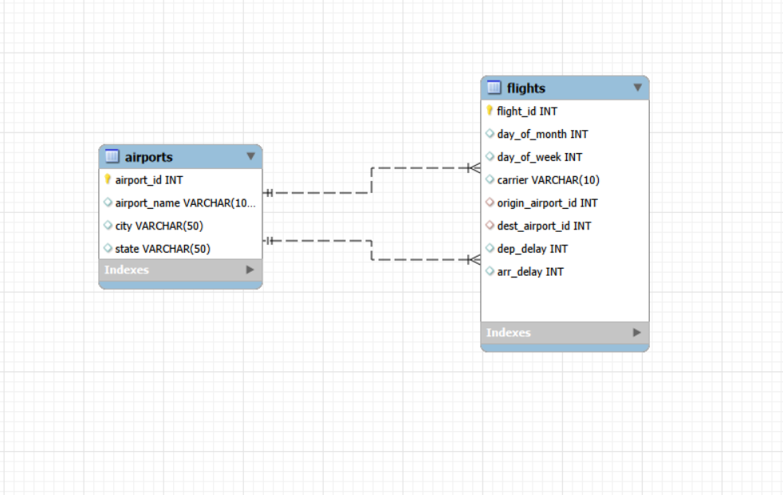

# Airline Flight Performance Analytics (SQL Project)

## 📌 Overview
This project is a SQL-only analytics case study built using a Kaggle airline flights dataset. 
It focuses on analyzing flight delays, airport performance, carrier reliability, and route-level 
patterns to support ad-hoc decision making and operational insights, similar to real-world airline analytics teams.

The project demonstrates strong SQL fundamentals, relational data modeling, and business-oriented analysis.

---

## 🧠 Business Objectives
- Analyze flight delay patterns across carriers and airports
- Measure on-time performance and operational efficiency
- Identify high-delay routes and congested airports
- Enable airport-level and route-level decision support using relational joins

---

## 🗂 Dataset
- Source: Kaggle (Flights & Airports Dataset)
- Columns used:
  - Flights: DayOfMonth, DayOfWeek, Carrier, OriginAirportID, DestAirportID, DepDelay, ArrDelay
  - Airports: AirportID, AirportName, City, State

> Dataset is used strictly for educational and analytical purposes.

---

## 🏗 Database Design (Star Schema)

### Fact Table
**flights**
- Stores individual flight records
- Contains delay metrics and foreign keys to airports

### Dimension Table
**airports**
- Stores airport master data (name, city, state)
- Linked to flights using airport IDs

---

## 🔗 Entity Relationship (EER Diagram)

The database follows a fact–dimension model where:
- One airport can be associated with many flights
- Flights reference airports as both origin and destination

📷 EER Diagram:

---

## 🛠 Tools & Technologies
- MySQL
- MySQL Workbench
- SQL (Joins, CTEs, Window Functions)
- GitHub

---

## 📊 Key Analyses Performed
- Average arrival and departure delays by carrier
- On-time performance percentage by airline
- Airport congestion and busiest departure points
- Route-level delay analysis using origin–destination joins
- Ranking carriers based on delay performance
- Scenario-based delay reduction analysis

---

## 📈 Sample Insight
- Certain carriers consistently show higher average arrival delays.
- A small number of airports contribute to a large share of delayed departures.
- Route-level analysis reveals operational bottlenecks between specific city pairs.

---

## 📁 Repository Structure

